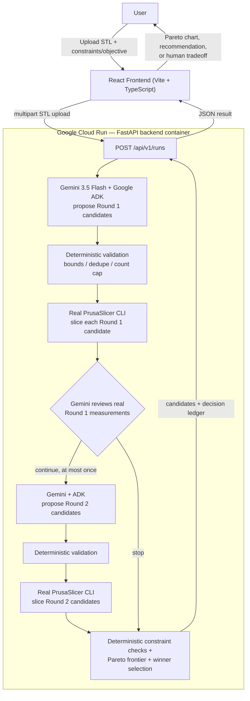

# Strata

An agentic system that autonomously designs, runs, and evaluates real manufacturing experiments to optimize a 3D-printed part.

Strata takes an STL file and a stated goal — minimize material, minimize print time, or balance both, under hard time/material limits — and closes the loop itself: Gemini proposes configurations to test, a real PrusaSlicer instance actually slices and measures each one, and deterministic code evaluates the real results, decides whether a second targeted round is worth running, and picks a winner. Nothing about the final numbers is predicted by the model — every print time and gram figure comes from a real slice.

## Demo

[Demo Video](ADD_DEMO_URL)

## The Problem

Getting a good print out of an FDM printer means picking layer height, infill density, and wall (perimeter) count — three settings that trade off against each other in ways that aren't obvious, and the only way to know the real outcome of a given combination is to actually slice it. Most people pick something that "feels reasonable" and slice once. The slicer has enough information to search this space properly; nobody's asking it the right sequence of questions.

## The Solution

Strata is an agentic optimization loop, not a settings recommender. It never asks an LLM to guess a print time or a filament weight — only PrusaSlicer, by actually slicing, can produce that number. Gemini's only job is deciding what's worth *trying*.

The implemented loop, verified end to end against a real deployment:

```
STL + objective/constraints
  → Gemini + Google ADK propose Round 1 candidate configurations
  → every proposal is deterministically validated (bounds, dedup, count cap)
  → each validated candidate is actually sliced by PrusaSlicer
  → real measured print time and material usage are collected
  → candidates are checked against the user's hard constraints
  → the Pareto-optimal (non-dominated) candidates are identified
  → Gemini reviews the real Round 1 measurements and decides whether a
    second, targeted round is worth proposing (bounded: at most 1 more
    round, 1 more Gemini call, 8 more candidates)
  → if it continues, Round 2 candidates go through the same
    validate → slice → measure → evaluate pipeline
  → deterministic code recomputes the global Pareto frontier and either
    selects a winner or, if multiple candidates are genuinely
    non-dominated, escalates the remaining tradeoff to the user
  → results, the full candidate set, and a decision ledger are returned
```

## Features

- STL upload with an interactive, client-side 3D preview (Three.js) before submitting
- User-declared hard constraints (max print time, max material) and an optimization objective (minimize material / minimize time / balanced)
- Gemini + Google ADK propose the first round of candidate configurations (layer height, infill, perimeter count)
- Every LLM proposal passes a deterministic validation boundary (range checks, NaN/Infinity rejection, deduplication, hard count cap) before it can reach the slicer
- Real PrusaSlicer CLI execution for every candidate — real measured print time and filament usage, never estimated
- Adaptive second round: Gemini reads Round 1's real measurements and decides whether to propose further, targeted candidates
- Deterministic Pareto-frontier analysis and constraint checking (never delegated to the LLM)
- Human-escalation path: when multiple candidates are genuinely non-dominated, Strata says so explicitly instead of guessing
- A decision ledger / agent trace showing what was proposed, measured, and decided at each step
- A "recorded run replay" demo mode that replays real captured optimization runs in the UI for cost-free demonstration, clearly labeled as such
- Deployed and running on Google Cloud Run with a real PrusaSlicer binary inside the container

## Architecture



`docs/architecture.md` has the full responsibility-boundary rationale (why the LLM is never trusted with a manufacturing number, and why every proposal is independently validated).

## How Strata Works

1. You upload an STL and set a production quantity, max print time, max material, and an objective.
2. The backend passes your goal to Gemini (via Google ADK), which proposes a bounded batch of candidate configurations — layer height, infill percent, perimeter count.
3. Every proposal is checked by plain deterministic code before anything runs: out-of-range or duplicate values are rejected, and the batch is capped, regardless of what the model returned.
4. Each surviving candidate is sliced by a real PrusaSlicer subprocess against your actual model, producing a real print time and filament weight.
5. Deterministic code checks each result against your hard constraints and computes which candidates are Pareto-optimal (no other candidate beats them on both time and material).
6. Gemini is given the real Round 1 measurements and decides whether a second, targeted round is worth proposing — it never sees or predicts numbers it wasn't measured.
7. If it continues, Round 2 candidates go through the same validate → slice → measure pipeline, and the Pareto frontier is recomputed across all candidates from both rounds.
8. You get the winning configuration (or, if several are genuinely tied on the tradeoff, a prompt to choose), the full candidate comparison, a Pareto chart, and a decision ledger explaining what happened.

## Tech Stack

| Layer | Technology | Purpose |
|---|---|---|
| Frontend | React + TypeScript + Vite | Upload UI, 3D STL preview, results/Pareto visualization |
| 3D preview | Three.js | Client-side STL rendering (dimensions, triangle count — no manufacturing estimates) |
| Backend | FastAPI (Python) | `/api/v1/runs` pipeline orchestration, `/health` |
| Agent | Gemini 3.5 Flash via Google ADK (`LlmAgent`, `Runner`) | Proposes Round 1 candidates; reviews Round 1 results to decide on Round 2 |
| Slicing | PrusaSlicer CLI (real binary, apt-installed in the container) | The only source of truth for print time and filament usage |
| Optimization | Plain deterministic Python (`app/optimization`, `app/agent/planner_validation.py`) | Proposal validation, constraint checks, Pareto dominance, winner selection |
| Hosting | Google Cloud Run | Runs the FastAPI backend + PrusaSlicer container |
| Secrets | Google Secret Manager | Gemini API key injected at deploy time — never baked into the image |
| Registry | Google Artifact Registry | Stores the built backend container image |
| Testing | pytest | 144 tests, offline by default (see Testing) |

## Running Locally

### Prerequisites

- Python 3.11+ (backend `pyproject.toml` requires `>=3.11`)
- Node.js 20.19+ or 22.12+ (per the frontend's Vite dependency's own engine requirement)
- PrusaSlicer installed locally, only if you want real slicing outside Docker (the frontend's "recorded run replay" mode needs no local PrusaSlicer at all)
- A Gemini API key, only if you want the real Gemini planner instead of the free deterministic mode (get one at https://aistudio.google.com/apikey)
- Docker, only if you want to build/run the Cloud Run container locally

### 1. Clone the repository

```bash
git clone https://github.com/dandreae/Strata.git
cd Strata
```

### 2. Backend setup

```bash
cd backend
python -m venv .venv
.venv/Scripts/activate        # Windows; use `source .venv/bin/activate` on macOS/Linux
pip install -e ".[dev]"
```

### 3. Environment variables

Copy `backend/.env.example` to `backend/.env` (read relative to the `backend/` working directory) and fill in only what you need:

```bash
# Optimization planner: "deterministic" (default, free, offline) or "gemini"
STRATA_PLANNER_MODE=deterministic
STRATA_GEMINI_API_KEY=your_key_here
STRATA_GEMINI_MODEL=gemini-3.5-flash

# PrusaSlicer binary — a bare command resolved via PATH, or an absolute path
STRATA_PRUSASLICER_BINARY_PATH=prusa-slicer
STRATA_PRUSASLICER_TIMEOUT_SECONDS=300

# Local storage for uploaded STLs / generated G-code
STRATA_STORAGE_BACKEND=local
STRATA_LOCAL_STORAGE_DIR=./data
STRATA_REPOSITORY_BACKEND=memory

# CORS — the frontend origin
STRATA_CORS_ALLOW_ORIGINS=["http://localhost:5173"]
```

`STRATA_GEMINI_API_KEY` is only required if `STRATA_PLANNER_MODE=gemini` — the server refuses to start in that mode without it (no silent fallback). Everything else has a working default. No value here is a real credential.

### 4. PrusaSlicer

Only needed if you're running the backend directly (not via Docker) and want real slicing rather than the frontend's replay mode. `STRATA_PRUSASLICER_BINARY_PATH` accepts either a bare command resolved via your system `PATH` (default: `prusa-slicer`) or an absolute path to the executable. If it can't be found, the backend fails clearly with `SlicerUnavailableError` rather than fabricating a result. The deployed Cloud Run image installs a real, version-pinned `prusa-slicer` via apt (Debian trixie) — see `backend/Dockerfile`.

### 5. Start backend

```bash
uvicorn app.main:app --reload
```

Runs at `http://localhost:8000`. Check `http://localhost:8000/health`.

### 6. Start frontend

```bash
cd frontend
npm install
npm run dev
```

### 7. Open Strata

`http://localhost:5173` (the URL Vite prints). The header toggle switches between **Recorded run replay** (real captured runs, no backend needed) and **Live backend** (hits your local backend above).

### 8. Run an optimization

Toggle to **Live backend**, upload an STL (`sample_data/cube_20mm.stl` or `sample_data/enclosure_tray.stl` both work), set a production quantity, max print time, max material, and an objective, then submit. With the default deterministic planner this costs nothing and needs no PrusaSlicer either — it'll fail cleanly with a clear error if PrusaSlicer isn't installed locally, rather than fabricating results.

## Google Cloud Deployment

The backend (FastAPI + a real PrusaSlicer binary) runs as a single container on **Google Cloud Run**. Nothing else is deployed — no Firestore, no Cloud Storage, no separate services.

```bash
# Enable the required APIs
gcloud services enable run.googleapis.com artifactregistry.googleapis.com secretmanager.googleapis.com \
  --project=<YOUR_PROJECT_ID>

# Build and push the backend image
cd backend
gcloud artifacts repositories create strata --repository-format=docker --location=<YOUR_REGION> \
  --project=<YOUR_PROJECT_ID>
docker build -t <YOUR_REGION>-docker.pkg.dev/<YOUR_PROJECT_ID>/strata/strata-backend:v1 .
docker push <YOUR_REGION>-docker.pkg.dev/<YOUR_PROJECT_ID>/strata/strata-backend:v1

# Store the Gemini key in Secret Manager (never in the image)
gcloud secrets create strata-gemini-api-key --replication-policy=automatic --project=<YOUR_PROJECT_ID>
echo -n "your_key_here" | gcloud secrets versions add strata-gemini-api-key --data-file=- --project=<YOUR_PROJECT_ID>

# Deploy
gcloud run deploy strata-backend \
  --image=<YOUR_REGION>-docker.pkg.dev/<YOUR_PROJECT_ID>/strata/strata-backend:v1 \
  --region=<YOUR_REGION> \
  --min-instances=0 --max-instances=1 --cpu=2 --memory=2Gi --timeout=600 \
  --set-env-vars=STRATA_PLANNER_MODE=gemini,STRATA_LOCAL_STORAGE_DIR=/tmp/strata-data \
  --set-secrets=STRATA_GEMINI_API_KEY=strata-gemini-api-key:latest \
  --no-allow-unauthenticated \
  --project=<YOUR_PROJECT_ID>
```

This is the actual sequence used to deploy and verify Strata end-to-end (real Gemini calls, real PrusaSlicer, real Cloud Run request/response) — `<YOUR_PROJECT_ID>`/`<YOUR_REGION>` are placeholders for a project and region of your own. `--no-allow-unauthenticated` keeps the service private; reach it with `gcloud run services proxy strata-backend --region=<YOUR_REGION>` for local testing against the real deployment.

## Testing

```bash
cd backend
pytest -q
```

Runs fully offline by default — no PrusaSlicer binary, no network, no Gemini credentials required (enforced by `pyproject.toml`'s `addopts`, not just convention). Covers the runs API, hard-constraint/Pareto/selection logic, the multi-round orchestrator (including partial-failure handling), the PrusaSlicer command builder and G-code parsing, the full Gemini/ADK planner boundary (schema validation, bounds, duplicates, retry-on-transient-error handling) with the ADK call itself mocked, and the health endpoint.

Two additional suites are excluded by default and only run on request, since they touch real external systems:

```bash
pytest -m integration -q     # requires a real installed PrusaSlicer binary
pytest -m gemini_smoke -v -s # requires a real, billable Gemini API key
```

## Project Structure

```
backend/
  app/agent/          Gemini + ADK planner, deterministic proposal validation
  app/slicer/          Real PrusaSlicer CLI adapter (command build + G-code parsing)
  app/optimization/     Constraint checks, Pareto frontier, winner selection
  app/services/         Pipeline orchestrator, storage, in-memory run repository
  app/api/v1/            /runs and /health routes
  Dockerfile              Cloud Run image (Debian trixie + apt-installed PrusaSlicer)
frontend/
  src/components/       Upload form, 3D viewer, agent pipeline/replay UI, Pareto chart, decision ledger
  src/lib/               API client, fixtures (real captured runs for replay mode)
docs/architecture.md    Full design rationale and responsibility boundaries
sample_data/            Sample STL files used for local testing/demos
```

## Findings & Learnings

- **Schema-valid LLM output is not the same as safe output.** Nothing stops a well-formed Gemini response from proposing an out-of-range or duplicate configuration; every proposal is independently bounds-checked, deduplicated, and count-capped in plain Python before it can reach PrusaSlicer or count as a real experiment.
- **Grounding the agent in a real tool changes what it can honestly claim.** Because PrusaSlicer — not Gemini — produces every print time and material figure, the system can never "hallucinate" a manufacturing result; a model failure or malformed response fails the run cleanly instead of quietly substituting a guess.
- **Hard constraints and Pareto analysis are the right place for guardrails, not the prompt.** Feasibility and dominance are computed deterministically, so the search space the LLM operates in is bounded by code, not by how well it followed instructions.
- **Adaptive value has to be earned, not assumed.** A simple test geometry (a solid cube) turned out to have an optimization landscape too easy to be worth a second round — a deliberately chosen thin-walled geometry with real parameter interactions was needed to demonstrate that Round 2 actually discovers something Round 1 could not.
- **Transient provider errors need narrow, deliberate handling.** Real Gemini calls occasionally return retryable errors (rate limiting, temporary unavailability); retrying blindly on any exception risks masking real bugs, so only the specific, confirmed-transient error codes are retried, with a hard cap and clear logging.

## Hackathon

Strata was built for Google's **All Things Agentic Hackathon**. It uses **Gemini 3.5 Flash** through the **Google Agent Development Kit (ADK)** as its planning agent, and is deployed on **Google Cloud Run** (with Google Artifact Registry and Google Secret Manager) as its execution environment.

## Third-Party Software

Strata uses PrusaSlicer as its slicing engine. PrusaSlicer is licensed under
the GNU Affero General Public License v3.0 and is developed by Prusa
Research. Strata invokes PrusaSlicer through its command-line interface for
slicing operations.

Strata also uses Google's Agent Development Kit (Apache License 2.0),
Google Gemini APIs subject to Google's applicable API terms, and Three.js
(MIT License).
